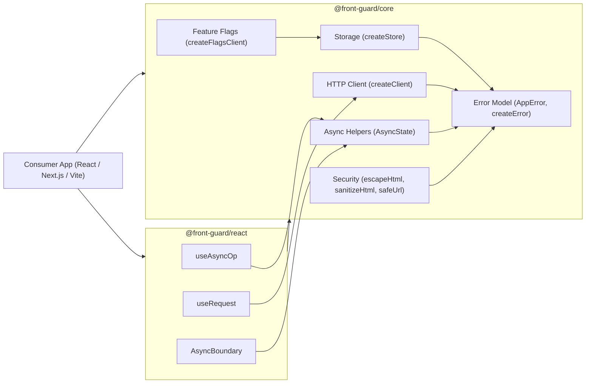

# 🛡️ front-guard


> **Guardrails for safe, reliable, and maintainable frontend engineering.**

---

## ✨ Overview

`front-guard` standardises the critical low-level utilities every frontend team rewrites:  
HTTP clients, storage, async handling, error models, feature flags, and security helpers —  
with idiomatic React bindings out of the box.

It’s **framework-agnostic**, **fully typed**, **SSR-safe**, and **production-ready**.

---

## 💬 Why this project?

`front-guard` was created to give frontend engineers a **safe, opinionated, and production-ready baseline** for building resilient applications.  
It removes recurring friction around HTTP, storage, async handling, and error boundaries —  
so teams can focus on delivering features, not boilerplate.

---

## 📦 Packages

| Package                                | Description                                                                 |
| -------------------------------------- | --------------------------------------------------------------------------- |
| [`@front-guard/core`](packages/core)   | Framework-agnostic core guardrails (HTTP, storage, async, flags, security). |
| [`@front-guard/react`](packages/react) | React bindings and async utilities built on the core.                       |

---

## 🚀 Quick Start

### 1️⃣ Install

```bash
pnpm add @front-guard/core
pnpm add @front-guard/react react
```

### 2️⃣ Local setup

```bash
pnpm install
pnpm build
pnpm test
```

### 3️⃣ Run example app

```bash
pnpm --filter front-guard-example-react-vite dev
```

Then open [http://localhost:5173](http://localhost:5173)

---

## 🧩 Example Usage

```tsx
import { createClient } from '@front-guard/core';
import { useRequest, AsyncBoundary } from '@front-guard/react';

const api = createClient({ baseUrl: 'https://api.example.com' });

export function Users() {
  const { status, data, error, refetch } = useRequest(api, '/users');

  return (
    <div>
      <button onClick={refetch}>Reload</button>
      <AsyncBoundary
        state={{ status, data, error }}
        loading={<p>Loading…</p>}
        error={(e) => <p style={{ color: 'red' }}>Error: {e.message}</p>}
        empty={<p>No users found.</p>}
        isEmpty={(users) => users.length === 0}
      >
        {(users) => (
          <ul>
            {users.map((u) => (
              <li key={u.id}>{u.name}</li>
            ))}
          </ul>
        )}
      </AsyncBoundary>
    </div>
  );
}
```

---

## 🧱 Architecture



---

## 🧪 Testing & Quality

- 🧠 **Tests:** Vitest
  - Node env → core package
  - jsdom env → React hooks
- ⚙️ **Hook testing:** `@testing-library/react`
- ✅ **CI:** GitHub Actions (build · lint · test · typecheck)
- 💅 **Linting:** ESLint + Prettier
- 📦 **Build:** `tsup` (ESM + CJS + types)

Run locally:

```bash
pnpm build && pnpm test
```

---

## 🔒 Security Notice

- `sanitizeHtml` is intentionally conservative — for rich text, use [DOMPurify](https://github.com/cure53/DOMPurify).
- `safeUrl` allows only `http:` and `https:` schemes.
- Never perform GET-based logout; always use POST with CSRF protection.

---

## 🤝 Contributing

1. Fork & clone the repo
2. Install dependencies with `pnpm install`
3. Run `pnpm build && pnpm test` before pushing
4. Open a PR following [Conventional Commits](https://www.conventionalcommits.org/)

---

## 📄 License

MIT © 2025 [ankova](https://github.com/ankova)

---
